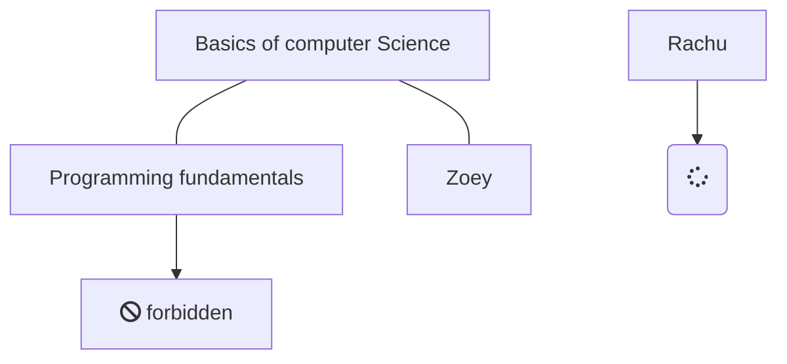

# Welcome

The classroom is an attempt at community driven learning and guidance to all things software engineering, with ability to navigate into different levels of expertise based on an interest. This challenge

The aim is to cover learning paths to become a generalist or a specialist, but also enough of basic skills to be able to be an autonomous software engineer

The classroom contains guides, learning material, books, projects, documentation and other useful tips (cheatsheets, utility tooling, learning and productivity tooling)

## A structured Learning Path

> All boxes are clickable to navigate through

 

