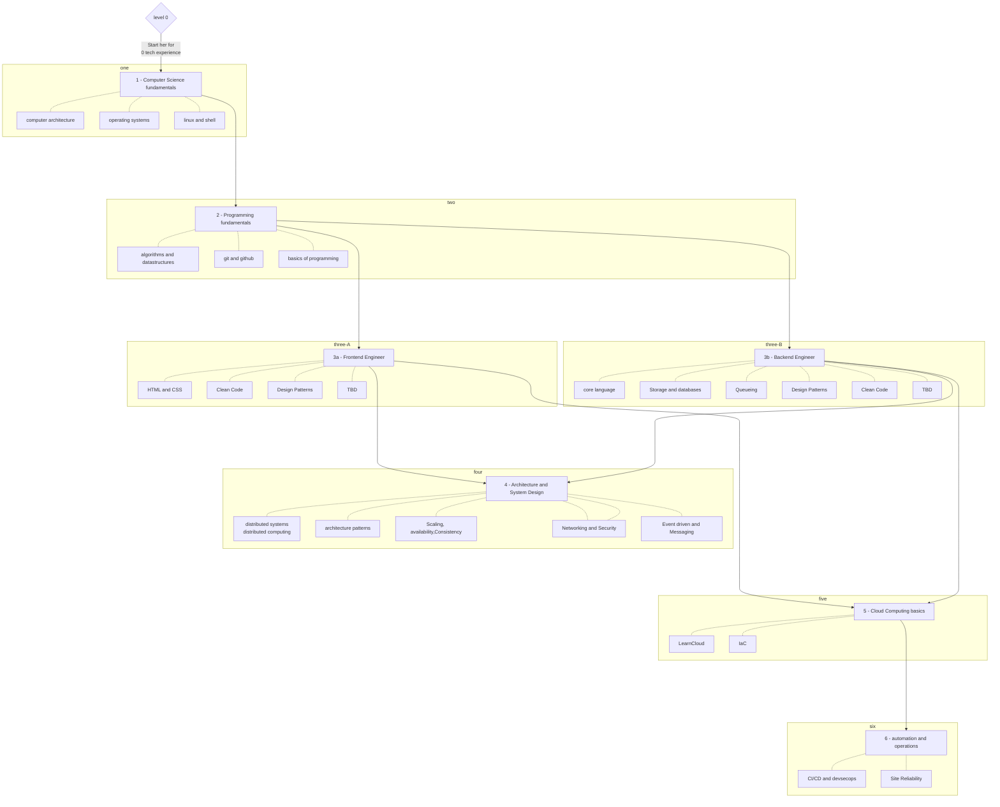

# Structured Learning Path

 is an attempt at community-driven learning and guidance to all things software engineering, with the ability to navigate into different levels of expertise based on interest. This challenge

The aim is to cover learning paths to becoming a generalist or a specialist, but also enough basic skills to be able to be an autonomous software engineer

The classroom contains guides, learning material, books, projects, documentation, and other valuable tips (cheatsheets, utility tooling, learning, and productivity tooling). The following is a flow of direction represented using [mermaid](https://mermaid-js.github.io/mermaid/#/) for the learning path

> All rectangle boxes are clickable to dive into that area in the following figure.

